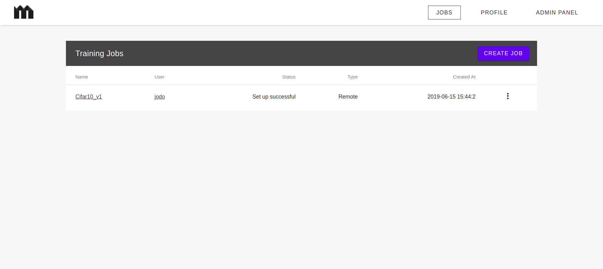
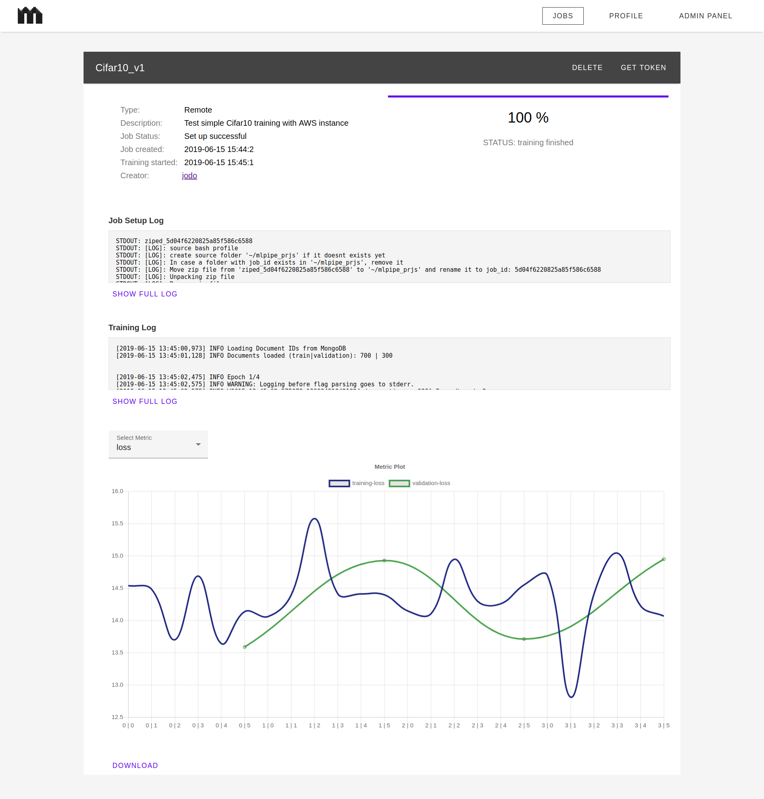

# MLPipe Viewer

ReactJS frontend implementation for the [MLPipe-Manager](https://github.com/j-o-d-o/MLPipe-Manager) server API to manage your tensorflow models and training results. Features including: User Managment, start training on remote machine, manage trainings, visualize results.

## Getting started

#### Prerequisite
- A working [MLPipe-Manager API](https://github.com/j-o-d-o/MLPipe-Manager)

```bash
# Clone the MLPipe-Viewer project from github
>> git clone https://github.com/j-o-d-o/MLpipe-Viewer.git
>> cd MLPipe-Viewer
```

Edit the file __src/config.js__ and adapt the the apiUrl with the endpoint for your MLPipe-Manager set up.</br>
Per default the app will run on Port 9000. Change the Port in __server.js__ as needed.

```bash
# Install dependencies & build & start
>> npm install
>> npm run build
>> node server.js

# or to start with pm2
pm2 start server.js --name MLPipe-Viewer
```

## The Looks

#### Job Managment
<kbd></kbd>

#### Training Info
<kbd></kbd>

## Serve via Nginx (optional)
In case you want to serve the GUI via Nginx follow these steps.
Prequists: Nginx installed, Certbot installed, Domain registered<br><br>
- Navigate to `>> cd /etc/nginx/sites-available`
- Create file `>> sudo nano my-domain.com` and use the settings below
- Create symbolic link `>> sudo ln -s /etc/nginx/sites-available/my-domain.com /etc/nginx/sites-enabled/`
- Restart Nginx `>> sudo service nginx restart`

```
# Nginx settings for my-domain.com

# Redirect http to https
server {
    listen 80;
    listen [::]:80;
    server_name my-domain.com;
    return 301 https://my-domain.com$request_uri;
}

# Main config
server {
    listen 443 ssl;

    server_name my-domain.com;

    location / {
        proxy_pass http://localhost:9000;
        proxy_http_version 1.1;
        proxy_set_header Upgrade $http_upgrade;
        proxy_set_header Connection 'upgrade';
        proxy_set_header Host $host;
        proxy_cache_bypass $http_upgrade;
    }
}
```

Next step is to create the certificate. You can either buy a https certificate or create one yourself with certbot by executing:
`>> sudo certbot --nginx -d my-domain.com` and restart nginx again since certbot added the certificate location the the nginx config file.</br>
A good tutorial on how to setup certbot can be found [here](https://www.digitalocean.com/community/tutorials/how-to-secure-nginx-with-let-s-encrypt-on-ubuntu-16-04)
